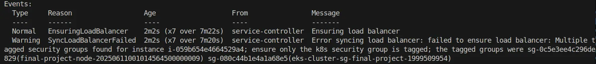

# To-Do Web Application on K8s & DocumentDB

## 🎯 Project Overview

- **Cloud Provider:** AWS
- **Containerization:** Docker
- **Kubernetes Cluster:** AWS EKS
- **DB**: Amazon DocumentDB (MongoDB Compatibility)
- **IaC:** Terraform
- **CI/CD:** Jenkins
- **Automation Tools:** Ansible & Bash

---

## 🏗️ Infrastructure Architecture


---

## 🔄 CI/CD Pipeline Flow


---

## 🏗️ Repository Structure

- [Docker Compose (3-tier Node.js)](Docker-Compose/3tier-nodejs/README.md) – Local Docker Compose setup and documentation
- [ArgoCD](argocd/README.md) – ArgoCD Kubernetes manifests and GitOps deployment
- [Terraform](Terraform/README.md) – Infrastructure as Code for AWS, EKS, Helm, and more
- [Ansible](Ansible/README.md) – Automation and configuration management
- [Jenkins](Jenkins/README.md) – CI/CD pipeline definitions

---


## 🧩 Introduction

This project is a fully containerized **To-Do web application** deployed on a highly available and scalable **Kubernetes cluster** on AWS, using an end-to-end **GitOps-driven CI/CD pipeline**.

The application consists of:

- A **React.js frontend** 
- A **Node.js backend** that handles API requests
- A managed **MongoDB-compatible database** using Amazon DocumentDB

Beyond application deployment, this project demonstrates a complete DevOps lifecycle using industry-standard tools:

- **Docker** is used to containerize both frontend and backend applications.
- **Terraform** provisions the entire cloud infrastructure, including the EKS cluster, IAM roles, VPC, security groups, and DocumentDB.
- **Ansible** is used for post-provisioning automation tasks like configuring Jenkins.
- **Jenkins** is used as the CI/CD orchestrator, executing pipelines that build, scan, and push Docker images to AWS ECR, then commit updated Kubernetes manifests to Git.
- **Argo CD** enables GitOps-based Continuous Deployment, automatically syncing Kubernetes manifests from the Git repo to the cluster.
- **Helm** is used to install and manage third-party components like Prometheus, Grafana, Argo CD, and the NGINX ingress controller.
- **Prometheus & Grafana** monitor application and pod-level metrics.
- **NetworkPolicies, HPAs, and Alerts** are used to implement best practices in Kubernetes.

This project showcases real-world skills in modern cloud-native infrastructure, automation, and application delivery — suitable for production-ready environments.

---
## Problems faced

### Problem 1: Creating a LoadBalancer Service

- When Creating the Load balancer service to provision an NLB on AWS
- The Nodes weren’t healthy
- `kubectl get svc service-name`



### Solution

- added this tag to the EKS module

```hcl
node_security_group_tags = {
    "kubernetes.io/cluster/final-project" = null
  }
```

## Why

- This tag is the same tag used for the EKS cluster
- So this tag will be attached to the SG of the node to make sure this nodes belongs to this cluster

---

### Problem 2: Connection issue between Frontend and Backend

- In a React App, is not enough to expose the frontend on an Ingress, you have to expose the backend as well unless using `server rendering`
- So the problem was trying to access the backend from the Link that only exposed the frontend and depended on the ClusterIP that exposes the backend internally

---

